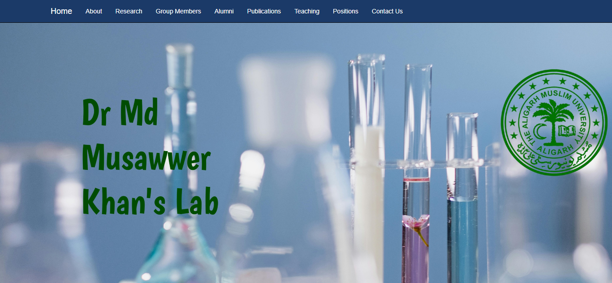
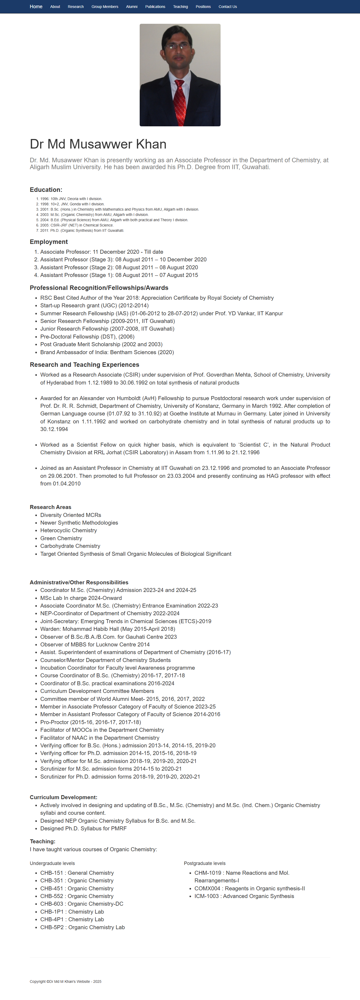
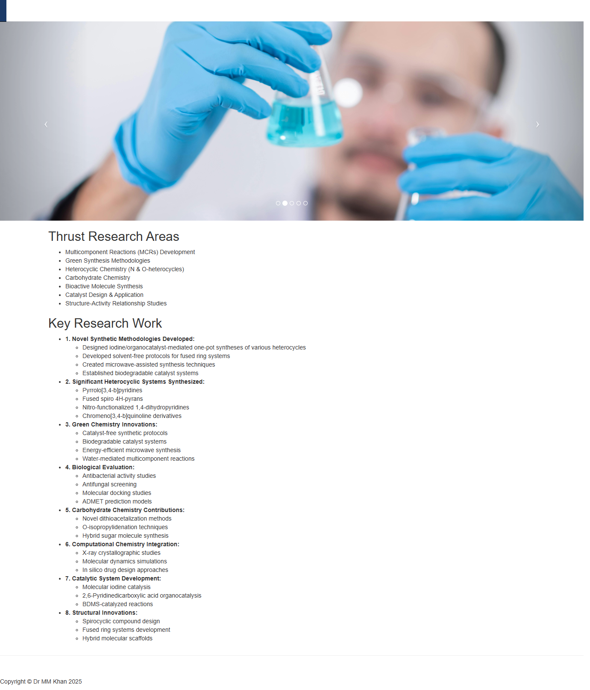
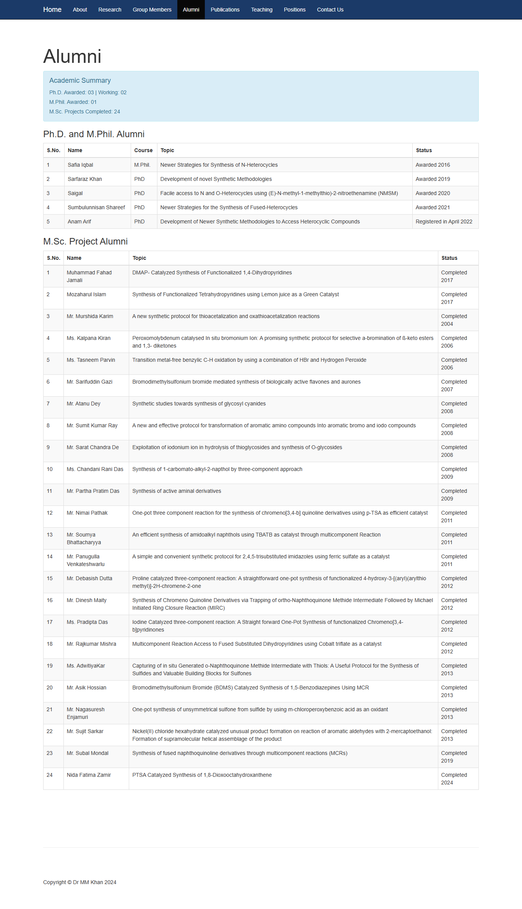
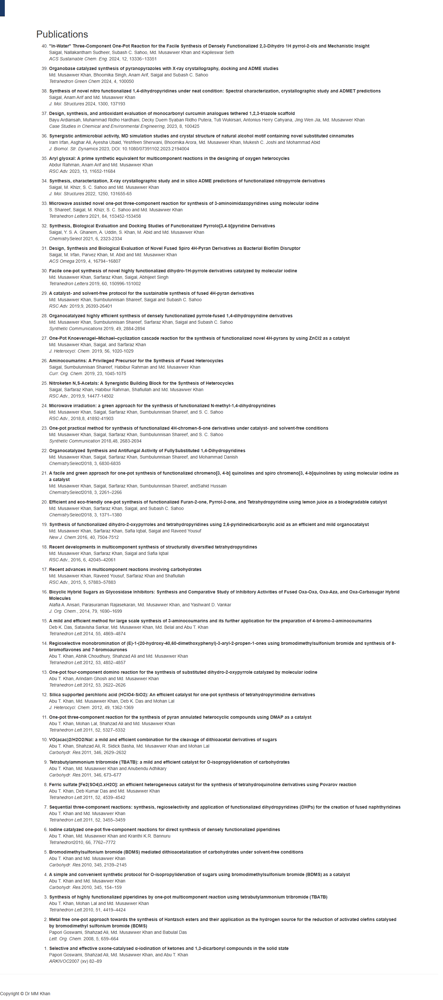
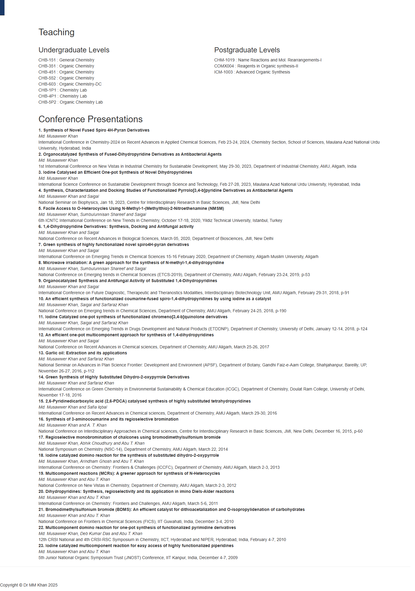
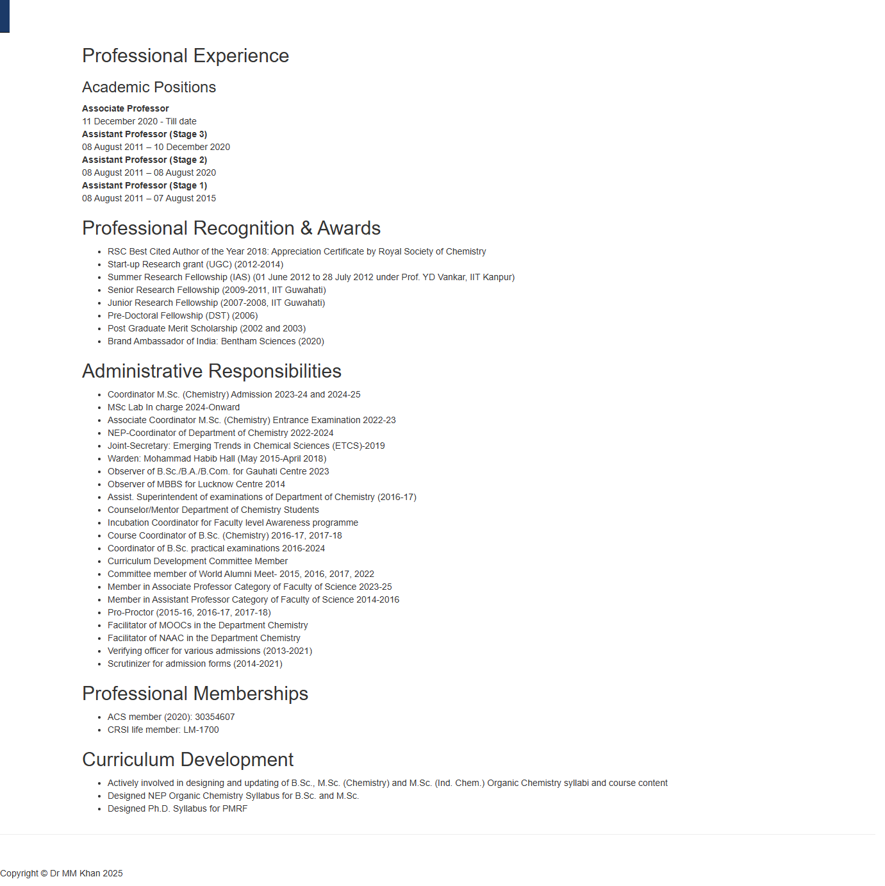
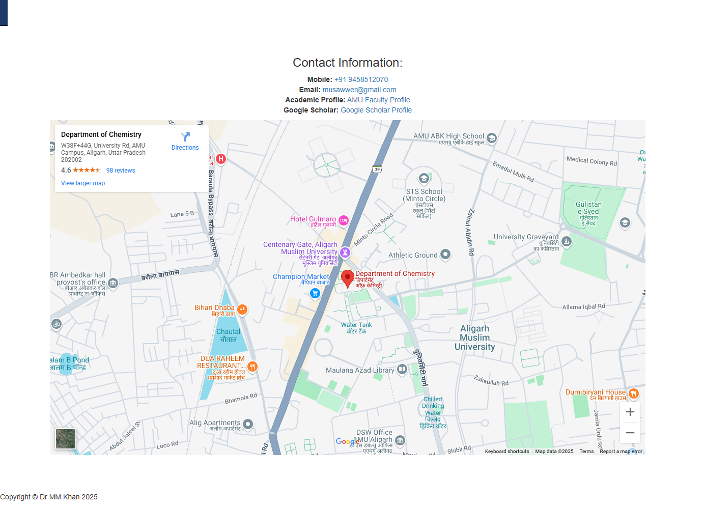

# MM-KHAN-LAB

## Project Overview

This is the official website for Dr. Md Musawwer Khan's research laboratory at the Department of Chemistry, Aligarh Muslim University. The website showcases the lab's research activities, academic contributions, and professional achievements.

## Key Features

- **Research Focus:** Specializes in organic synthesis, heterocyclic chemistry, and green chemistry methodologies
- **Academic Overview:** Comprehensive information about teaching, publications, and student supervision
- **Research Areas:**
  - Multicomponent Reactions (MCRs) Development
  - Green Synthesis Methodologies
  - Heterocyclic Chemistry (N & O-heterocycles)
  - Carbohydrate Chemistry
  - Bioactive Molecule Synthesis
  - Catalyst Design & Application
  - Structure-Activity Relationship Studies

## Academic Achievements

- **Publications:** 40+ peer-reviewed publications
- **Citations:** 1570+ (as of 2024)
- **H-index:** 20
- **Student Supervision:**
  - Ph.D. Awarded: 03
  - M.Phil. Awarded: 01
  - M.Sc. Projects Completed: 24

## Professional Recognition

- RSC Best Cited Author (2018)
- Brand Ambassador of India: Bentham Sciences (2020)
- Member of American Chemical Society (ACS)
- Life Member of Chemical Research Society of India (CRSI)

## Website Structure

- **Home:** Introduction and overview
- **About:** Professional background and qualifications
- **Research:** Detailed research areas and achievements
- **Group Members:** Current research team
- **Alumni:** Past group members and their achievements
- **Publications:** Complete list of research publications
- **Teaching:** Course information and academic contributions
- **Positions:** Professional experience and responsibilities
- **Contact:** Contact information and location details

## Development

Website developed and maintained by [Suhel Khan](https://github.com/suhelkhanca)

## Detailed Technical Description

### Website Technologies

- HTML5 and CSS3 for modern web standards compliance
- Bootstrap framework for responsive design
- JavaScript/jQuery for interactive features
- Custom CSS for specialized styling
- Mobile-first approach for optimal viewing across devices

### Key Components

1. **Navigation System**

   - Responsive navbar with collapsible menu
   - Consistent navigation across all pages
   - Active page highlighting

2. **Content Organization**

   - Modular page structure
   - Clear information hierarchy
   - Responsive grid layouts
   - Image optimization for fast loading

3. **Research Showcase**

   - Dynamic carousel for research highlights
   - Structured presentation of publications
   - Organized display of research areas
   - Interactive project galleries

4. **Academic Information**

   - Tabulated course details
   - Structured publication listings
   - Student supervision records
   - Research achievement metrics

5. **Contact Integration**
   - Google Maps integration
   - Contact form functionality
   - Social media links
   - Professional network connections

### File Structure

```
mmkhanlab/
├── index.html          # Main landing page
├── profkhan.html       # About page
├── research.html       # Research activities
├── group.html          # Current team
├── alumni.html         # Past members
├── pub.html           # Publications
├── teaching.html      # Academic courses
├── positions.html     # Professional roles
├── contact.html       # Contact information
├── css/               # Styling files
├── js/                # JavaScript files
└── images/            # Media assets
```

### Maintenance

- Regular content updates
- Performance optimization
- Security maintenance
- Backup management
- Analytics tracking

## Preview


















## Copyright

© 2025 Dr MM Khan. All rights reserved.
